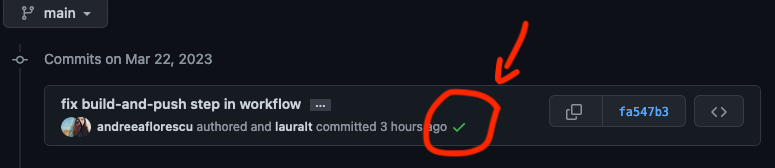

# rust-vmm-container

**`rustvmm/dev`** is a container with all dependencies used for running
`rust-vmm` integration and performance tests. The container is available on
Docker Hub and has support for `x86_64` and `aarch64` platforms.  
`riscv64` CI is also supported but using [workaround explained here](#workaround-for-supporting-risc-v-ci).  

Due to the workaround, we have two separate Docker Hub repositories:
- For the latest available tag for `x86_64` and `aarch64`, 
please check the `rustvmm/dev` builds available on 
[Docker Hub](https://hub.docker.com/r/rustvmm/dev/tags).  
- For the latest available tag for `riscv64`, 
please check the `rustvmm/dev_riscv64` builds available on 
[Docker Hub](https://hub.docker.com/r/rustvmm/dev_riscv64/tags).

## Know Issues

For now rust is installed only for the root user.

### Workaround for supporting RISC-V CI
Unlike x86/ARM CI, currently there is no RISC-V Buildkite agent platform.  
As a workaround, QEMU is used to run RISC-V CI on x86 Buildkite agent platform.  
As a result,
- a dedicated `Dockerfile.riscv64` is used to build such container image containing QEMU along with cross-compiled OpenSBI, Linux, and rootfs.
- a dedicated [Docker Hub repository](https://hub.docker.com/r/rustvmm/dev_riscv64/tags) `rustvmm/dev_riscv64` is used to store such container image.

## Using the Container

The container is currently used for running the integration tests for the
majority of rust-vmm crates.

Example of running cargo build on the kvm-ioctls crate:

```bash
> git clone git@github.com:rust-vmm/kvm-ioctls.git
> cd kvm-ioctls/
> docker run --volume $(pwd):/kvm-ioctls \
         rustvmm/dev:$VERSION \
         /bin/bash -c "cd /kvm-ioctls && cargo build --release"
 Downloading crates ...
  Downloaded libc v0.2.48
  Downloaded kvm-bindings v0.1.1
   Compiling libc v0.2.48
   Compiling kvm-bindings v0.1.1
   Compiling kvm-ioctls v0.0.1 (/kvm-ioctls)
    Finished release [optimized] target(s) in 5.63s
```

Examples of running cargo build/test for riscv64 can be found in [riscv64/examples/docker-test.sh](`riscv64/examples/docker-test.sh`).

## Publishing a New Version

A new container version is published for each PR merged to main that adds
changes to the [Dockerfile](Dockerfile) or the related scripts. Publishing the
container happens automatically through the
[.github/worflows](.github/workflows) and no manual intervention is required.

You can check the progress of a commit being published to Docker Hub by looking
at the GitHub commit history, and clicking on the status check of the relevant
commit.



### Manual Publish

If for any reason the GitHub workflow is not working and a new container
version was not automatically pushed when merging the Dockerfile changes to
the main branch, you can follow the steps below for a manual publish.

The rust-vmm organization on Docker Hub is free and thus has only 3 members
that are allowed to publish containers:
- [Andreea Florescu](https://github.com/andreeaflorescu)
- [Laura Loghin](https://github.com/lauralt)
- and the rust-vmm bot account

#### Manual Publish for `x86_64` and `aarch64`
On an `aarch64` platform:

```bash
> cd rust-vmm-dev-container
> ./docker.sh build
> ./docker.sh publish
```

You will need to redo all steps on an `x86_64` platform so the containers are
kept in sync (same package versions on both `x86_64` and `aarch64`).

Now that the tags `v4_x86_64` and `v4_aarch64` are pushed to Docker Hub, we can
go ahead and also create a new version tag that points to these two builds
using
[docker manifest](https://docs.docker.com/engine/reference/commandline/manifest/).

```bash
./docker.sh manifest
```

If it is the first time you are creating a docker manifest, most likely it will
fail with: ```docker manifest is only supported when experimental cli features
are enabled```. Checkout
[this article](https://medium.com/@mauridb/docker-multi-architecture-images-365a44c26be6)
to understand why and how to fix it.

#### Manual Publish for `riscv64`
For `riscv64` CI container image, the above steps are a little bit different due to the [workaround](#workaround-for-supporting-risc-v-ci) needed to support `riscv64` CI:
- `ARCH=riscv64` needs to be specified because `riscv64` has dedicated Dockerfile.riscv64 and Docker Hub repository.
- The commands are run on x86 platform because the container image is to be run on x86 Buildkite agent platform.
```bash
> cd rust-vmm-container
> ARCH=riscv64 ./docker.sh build
> ARCH=riscv64 ./docker.sh publish
> ARCH=riscv64 ./docker.sh manifest
```
